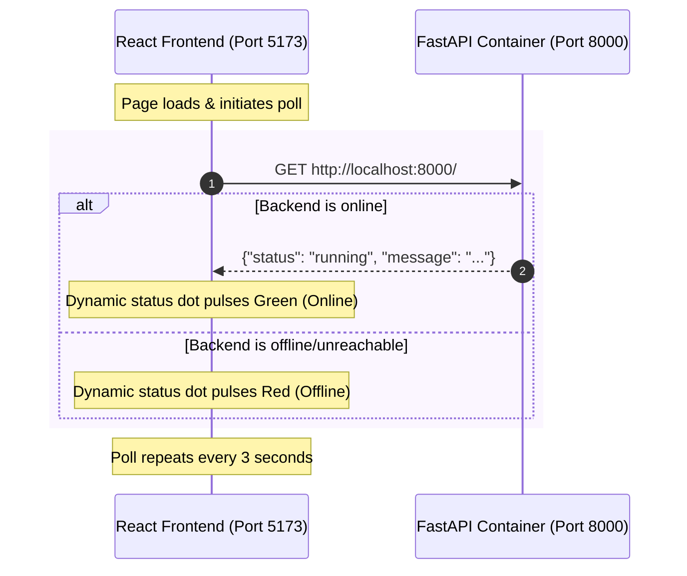

# 🔮 vittSarathi - Intelligent AI Playground

A high-fidelity playground application featuring a containerized **FastAPI** backend and a sleek, modern **React + Vite** frontend. The setup is designed with a premium dark theme, neon glowing aesthetics, and a dynamic glassmorphic card that real-time monitors the connection status of the FastAPI backend.

---

## 🎨 Tech Stack & Design Architecture

*   **Backend:** FastAPI (Python 3.11-slim container)
*   **Frontend:** React 18, Vite, Vanilla CSS
*   **Aesthetics:** Glassmorphism, Neon Violet/Cyan gradients, active state glow effects, custom typography (`Outfit` & `Inter` from Google Fonts).
*   **Containerization:** Docker & Docker Compose

### 🔄 Communication Flow



---

## 📁 Workspace Directory Structure

```text
vittSarathi/
├── backend/
│   ├── app/
│   │   ├── __init__.py
│   │   └── main.py              # FastAPI application with CORS middleware
│   ├── Dockerfile               # Multi-stage/Slim optimized container build
│   └── requirements.txt         # Backend Python dependencies
├── frontend/
│   ├── public/
│   ├── src/
│   │   ├── App.css              # Custom layout, animations & glassmorphic styles
│   │   ├── App.jsx              # Status checker logic & layout markup
│   │   ├── index.css            # Root design system & global styling tokens
│   │   └── main.jsx
│   ├── eslint.config.js
│   ├── index.html
│   ├── package.json
│   └── vite.config.js
├── docker-compose.yml           # Runs backend in hot-reload mode
└── readme.md                    # Project documentation (this file)
```

---

## 🚀 Quick Start Guide

### 📋 Prerequisites
*   [Docker Desktop](https://www.docker.com/products/docker-desktop/) (for containerized backend)
*   [Node.js](https://nodejs.org/) v18+ (for local frontend development)

---

### 1. Spin Up the Backend (Docker)
Open your terminal in the root directory `c:\Satyam\vittSarathi` and run:
```powershell
docker compose up -d
```
This builds the image, starts the backend container, exposes port `8000`, and mounts the `./backend` directory for hot-reloading.

*   Verify backend is alive: Open [http://localhost:8000/](http://localhost:8000/) in your browser.

---

### 2. Start the Frontend (Vite)
Navigate to the `frontend` folder and run the developer server:
```powershell
cd frontend
npm install
npm run dev
```
Open [http://localhost:5173/](http://localhost:5173/) to witness the glassmorphic status UI in action.

---

## ⚙️ Configuration Reference

### Docker Compose Configuration (`docker-compose.yml`)
The container mounts the local folder using a bind mount to automatically pick up edits to the Python source files:
```yaml
version: '3.8'

services:
  backend:
    build:
      context: ./backend
      dockerfile: Dockerfile
    container_name: vittsarathi_backend
    ports:
      - "8000:8000"
    volumes:
      - ./backend:/workspace
    environment:
      - PYTHONUNBUFFERED=1
      - ENV=development
    restart: always
```

### CORS Configuration (`backend/app/main.py`)
To prevent cross-origin issues during local development, FastAPI is configured to accept requests from all origins:
```python
from fastapi.middleware.cors import CORSMiddleware

app.add_middleware(
    CORSMiddleware,
    allow_origins=["*"],
    allow_credentials=True,
    allow_methods=["*"],
    allow_headers=["*"],
)
```

---

## 🛠️ Essential Commands

### Container Administration
| Task | Command |
| :--- | :--- |
| **Start Services** | `docker compose up -d` |
| **Stop Services** | `docker compose down` |
| **Force Rebuild** | `docker compose up --build -d` |
| **Stream Live Logs** | `docker logs -f vittsarathi_backend` |

### Frontend Administration
| Task | Command |
| :--- | :--- |
| **Run Dev Server** | `npm run dev` |
| **Production Build** | `npm run build` |
| **Preview Build** | `npm run preview` |

---

## 💎 Design System & Token Guide

The frontend features a meticulously designed token system in `frontend/src/index.css`:

*   **Primary Glow Orb:** A floating radial gradient background animation mimicking depth.
*   **Glassmorphic Border:** Rendered using CSS mask-composites to achieve a true high-fidelity border gradient:
    ```css
    background: linear-gradient(135deg, rgba(168, 85, 247, 0.4), rgba(34, 211, 238, 0.1), rgba(244, 63, 94, 0.4));
    ```
*   **Pulse Indicators:** Animated rings around connection status badges using custom `@keyframes` for `online`, `offline`, and `checking` states.
