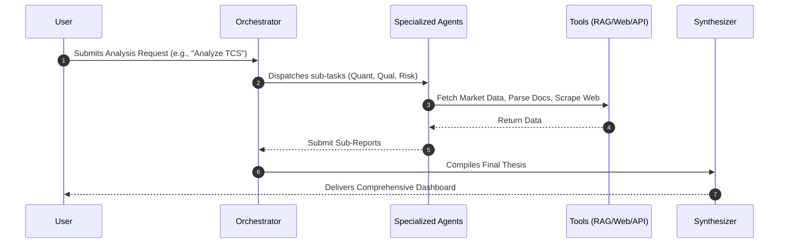

# 🔮 vittSarathi - Intelligent Financial AI Agent

A high-fidelity financial analysis platform featuring a containerized **FastAPI** multi-agent backend and a sleek, modern **React + Vite** frontend. The application uses a fleet of specialized AI agents (Quantitative, Qualitative, Risk & Governance) backed by a RAG pipeline and web scraping tools to deliver comprehensive stock analyses. The frontend features a premium dark theme, neon glowing aesthetics, and dynamic glassmorphic elements.

---

## 🎨 Tech Stack & Architecture

### 🧠 Backend (AI & Data Processing)
*   **Framework:** FastAPI (Python 3.11)
*   **AI Framework:** LangChain & LangGraph (Multi-Agent Architecture)
*   **Specialized Agent Fleet:**
    *   **The Orchestrator:** The brain of the system. Reads the user query, generates an execution plan, and dynamically dispatches tasks to relevant specialized agents.
    *   **The Accountant (Quantitative Agent):** Performs deep financial ratio analysis, valuation, and margin trends. Features sub-agents for DCF modeling, peer comparison, and segment-level revenue splitting.
    *   **The Strategist (Qualitative Agent):** Evaluates business moats and management commentary. Features sub-agents that run NLP on earnings calls to track management credibility and score competitive moats using Porter's 5 forces.
    *   **The Investigator (Risk & Governance):** Conducts skeptical investigations of red flags. Scans for active litigations, tracks promoter pledging history, and analyzes related-party transactions for tunneling patterns.
    *   **The Pulse Reader (Sentiment & Macro):** Analyzes market mood via FinBERT, tracks FII/DII institutional flows, and measures sector rotation momentum.
*   **Advanced RAG Pipeline:** 
    *   Uses **PostgreSQL + pgvector** for high-dimensional vector embeddings.
    *   Features a sophisticated hybrid retrieval system utilizing a Vector Store, Page Index Store, and Reference Store.
    *   Supports metadata filtering (Company, Year, Quarter, Report Type) and custom Context Assembly to feed precise, verified context to the LLMs.
*   **Tools:**
    *   `yfinance` for real-time market data.
    *   Playwright MCP (Model Context Protocol) server for web scraping.
*   **Database:** PostgreSQL with `pgvector` extension.

### 💻 Frontend (UI/UX)
*   **Framework:** React 19, Vite, Vanilla CSS
*   **Features:** Real-time agent status tracking, Markdown-rendered analysis reports, document upload & management, conversational chat interface.
*   **Aesthetics:** Glassmorphism, Neon Violet/Cyan gradients, active state glow effects, custom typography (`Outfit` & `Inter`).

### 🐳 Containerization
*   **Docker & Docker Compose** for seamless orchestration of the Backend, DB, and Playwright MCP server.

---

## 🔄 Multi-Agent Workflow



---

## 📁 Workspace Directory Structure

```text
vittSarathi_close/
├── backend/
│   ├── src/
│   │   ├── agents/      # Multi-agent implementations (Orchestrator, Quant, Qual, etc.)
│   │   ├── api/         # FastAPI routes, controllers, and schemas
│   │   ├── rag/         # RAG pipeline (ingestion, retrieval, pgvector models)
│   │   ├── tools/       # Tools (yfinance, web scraper)
│   │   └── mcp/         # MCP integration configuration
│   ├── run_demo.py      # CLI for testing RAG ingestion and querying
│   ├── Dockerfile
│   └── requirements.txt
├── frontend/
│   ├── src/
│   │   ├── components/  # React components (ChatPanel, AnalysisReport, etc.)
│   │   ├── hooks/       # Custom React hooks for analysis & health check
│   │   ├── App.tsx      # Main application layout & status checker logic
│   │   └── index.css    # Root design system & global styling tokens
│   ├── index.html
│   └── package.json
└── docker-compose.yml   # Runs backend, pgvector DB, and Playwright MCP
```

---

## 🚀 Quick Start Guide

### 📋 Prerequisites
*   [Docker Desktop](https://www.docker.com/products/docker-desktop/) (for backend, db, and MCP)
*   [Node.js](https://nodejs.org/) v18+ (for frontend)
*   An OpenAI API Key (or supported LLM provider) - configure in `backend/.env`.

---

### 1. Configure Environment Variables
Create a `.env` file in the `backend` directory (use `.env.example` as a template):
```env
OPENAI_API_KEY=your-api-key-here
# Other necessary API keys for integrations
```

### 2. Spin Up the Backend Stack (Docker)
Open your terminal in the root directory and run:
```powershell
docker compose up -d
```
This starts the PostgreSQL (pgvector) database, the Playwright MCP server, and the FastAPI backend (hot-reloading enabled).
*   Verify backend is alive: Open [http://localhost:8000/docs](http://localhost:8000/docs) in your browser.

### 3. Start the Frontend (Vite)
Navigate to the `frontend` folder and run the dev server:
```powershell
cd frontend
npm install
npm run dev
```
Open [http://localhost:5173/](http://localhost:5173/) to interact with the application.

---

## 🛠️ Essential Commands & Scripts

### Container Administration
| Task | Command |
| :--- | :--- |
| **Start Services** | `docker compose up -d` |
| **Stop Services** | `docker compose down` |
| **Force Rebuild** | `docker compose up --build -d` |
| **Stream Live Logs** | `docker logs -f vittsarathi_backend` |

### RAG CLI (`run_demo.py`)
Test the RAG pipeline locally:
```bash
# Initialize Database
python backend/run_demo.py init-db

# Ingest a PDF Report
python backend/run_demo.py ingest /path/to/report.pdf --company RIL --year 2024 --type annual

# Query the System
python backend/run_demo.py query "What was the total revenue in 2024?"
```

### Frontend Administration
| Task | Command |
| :--- | :--- |
| **Run Dev Server** | `npm run dev` |
| **Production Build** | `npm run build` |

---

## 💎 Design System & Token Guide

The frontend features a meticulously designed token system in `frontend/src/index.css`:

*   **Primary Glow Orb:** A floating radial gradient background animation mimicking depth.
*   **Glassmorphic Border:** Rendered using CSS mask-composites to achieve a true high-fidelity border gradient:
    ```css
    background: linear-gradient(135deg, rgba(168, 85, 247, 0.4), rgba(34, 211, 238, 0.1), rgba(244, 63, 94, 0.4));
    ```
*   **Pulse Indicators:** Animated rings around connection status badges using custom `@keyframes` for `online`, `offline`, and `checking` states.
